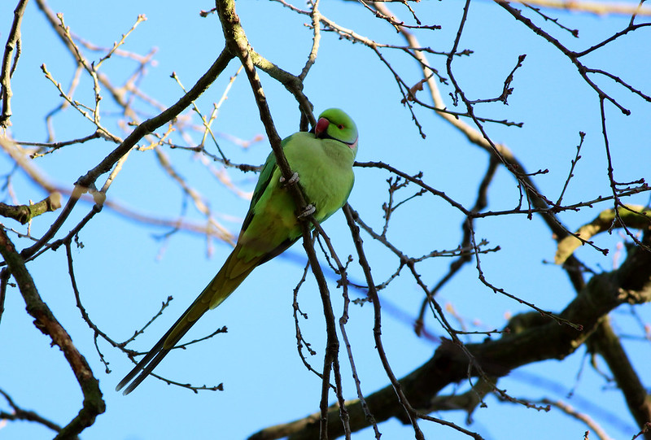
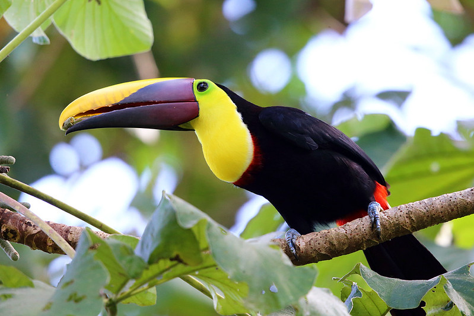
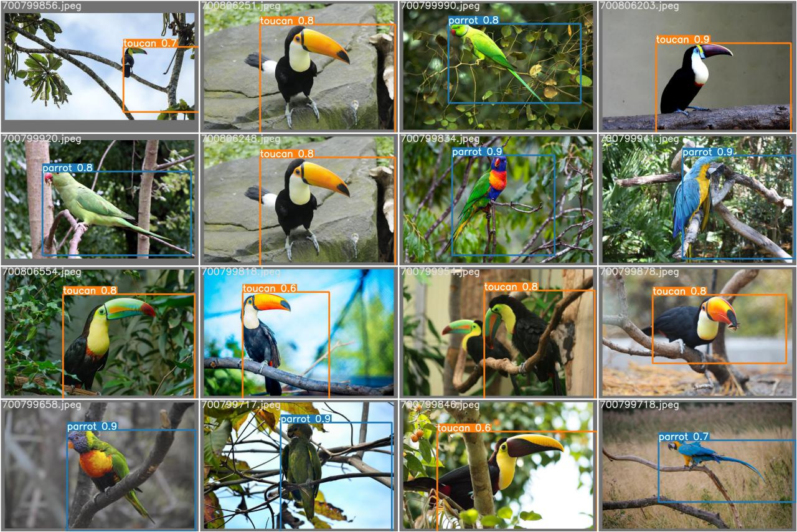
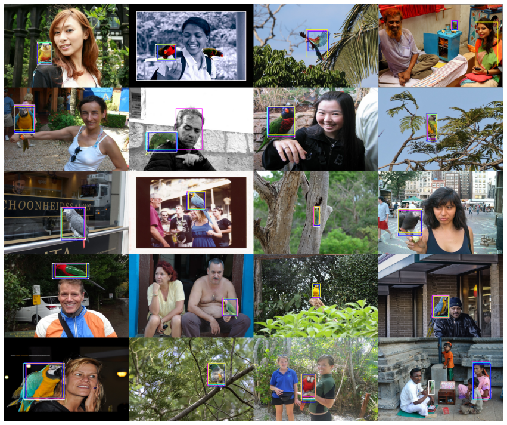

# Parrot & toucan
NN for the detection task parrot and toucan

Ok, this two project

## Project1_yolo5, [YOLO5](https://github.com/ultralytics/yolov5)
- Train data have image in forest parrot and toucan
- for train use train test split 
- 150 epoch
- yolo5m
  
This project we detect on image parrot or toucan on photos.

Who is who:
This Parrot             |  This guy or not, is Toucan
:-------------------------:|:-------------------------:
  |  

 tree:
 - flask_visual_result.ipynb - use for visual predict images(load data form 
        test_img_uplode folder)
- viz_preprocessing.ipynb same param for visual flask
- yolo5_parrot_toucan.ipynb tarin and predict model

Result & Vizual:
```
Epoch   gpu_mem       box       obj       cls     total    labels  img_size     
149/149      5.8G   0.01731   0.01388  0.008292   0.03948        16       640: 100% 9/9 [00:02<00:00,  4.11it/s]   
               Class      Images      Labels           P           R      mAP@.5  mAP@.5:.95: 100% 3/3 [00:01<00:00,  2.28it/s]
                 all          38          38       0.979           1       0.995       0.909
              parrot          38          16       0.958           1       0.995       0.938
              toucan          38          22           1           1       0.995        0.88

150 epochs completed in 0.229 hours.
```

This how fast make detection but i not like magic and a make project 2

-------------------

## Project2_rcnn(fasterrcnn_resnet50)
  - New data, only parrot, train parrot image from forest
  - test data on image have people image not changed.
  - for visual use streamlit

  Predict by each fold:
  
   

  
  for visual use streamlit run src/streamlit_viz.py 

  loads pretrain model 1GB [link](https://drive.google.com/drive/folders/1zoVPg9hn-cKalaP8_5SqT6ocuHAeY9kt?usp=sharing)

## RESUME

По прошествии нескольких дней я вижу свои ошибки. Один из первых датасетов и разметок я сделал для yolo, на этих данных модель смогла показать результат, но она ошибается на новых. Проблема, это данные которые я сделал для yolo(они не приведены к одному формату, картинки разные по содержанию, размер объектов на изображении тоже очень разный, данных мало и тд).

Когда я стал делать rcnn я не смог на этих данных что-то на тренировать. Я сделал много вариантов датасетов и получил адекватные результаты(более тщательный выбор данных, один размер 512*512, добавил теги для фолдов, более четкая разметка)

Не спроста я не остановился на yolo, после rcnn я смог увидеть много проблем. Я оставлю, как есть данные для сравнения, но в ближайшие время переделаю их.

TODO:
- make new data to yolo
- try more label on one image
- .....