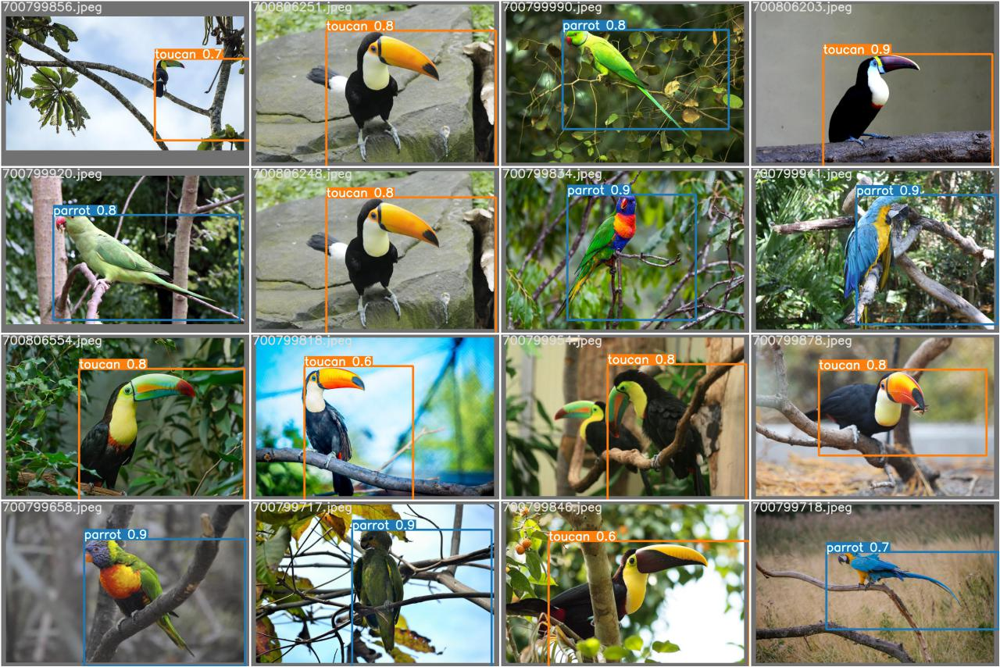

# Parrot & toucan
NN for the detection task parrot and toucan.

For marking up images, I used [supervise.ly](https://supervise.ly/).

Ok, this two project.

## Project1_yolo5, [YOLO5](https://github.com/ultralytics/yolov5)

Task to detected toucan or parrot on image:

- Train data have image in forest parrot and toucan
- for train use train_test_split 
- 150 epoch
- yolo5m
  
Who is who:
This Parrot             |  This guy or not, is Toucan
:-------------------------:|:-------------------------:
  |  

 tree:
 - flask_visual_result.ipynb - use for visual predict images(load data form 
        test_img_upload folder)
- viz_preprocessing.ipynb - same param for visual flask
- yolo5_parrot_toucan.ipynb - train and predict model

Result & Vizual:
```
Epoch   gpu_mem       box       obj       cls     total    labels  img_size     
149/149      5.8G   0.01731   0.01388  0.008292   0.03948        16       640: 100% 9/9 [00:02<00:00,  4.11it/s]   
               Class      Images      Labels           P           R      mAP@.5  mAP@.5:.95: 100% 3/3 [00:01<00:00,  2.28it/s]
                 all          38          38       0.979           1       0.995       0.909
              parrot          38          16       0.958           1       0.995       0.938
              toucan          38          22           1           1       0.995        0.88

150 epochs completed in 0.229 hours.
```

This how model make detection, but i not like magic and decided to make project2.

-------------------

## Project2_rcnn(fasterrcnn_resnet50)

Task to find where parrot on image:

  - New data, only parrot, image of parrots in the forest, maked resize(512*512), add tags(different size parrot on image)
  - model train:
      - train_test_split 40 epoch.
      - stratified folds by tags 40 epoch..
      - argumentation(img, bbox)
  - test data: images contain people and previously unseen compositions, image not changed(size).
  - for visual use streamlit

  Predict by each fold:
    

  -v1. 3 may, result (no argumentation and scheduler):
  ```
  each folds [0.7906, 0.7209, 0.7843, 0.7850,0.715]    
  mean - 0.75916
  std  -  0.033770199880960146
  ```
  -v2. 5 may, result (with argumentation and scheduler):
  ```
  each folds [0.7576,0.7638,0.794,0.754, 0.7579] 
  meam - 0.76546
  std  - 0.01461199507254229
  ```
You can see that in the first variant, the variance of values is much larger, the model is not stable, the addition of argumentation and a method to reduce the learning rate led to better results (they are far from ideal), but we reduced the variance, which means that the model generalizes the data better, the result became more stable. 

Update 6 may:

I wondered how the result would change if I added new data. I added about 50 images, but the result did not change much, even worsened. Searching for the problem led me to an imbalance (large, medium and small parrots), as a rule, when they take photographs of parrots, they want to make them as large as possible, so there are few images with small parrots.
I sampled the old ones + the new ones and eventually evened out the imbalance. 

Train folds_curve:
 
```
batch size = 4,
убрал A.VerticalFlip(p=0.5) у меня нет перевернутых попугаев
each folds [0.799,0.766,0.789,0.773,0.775]
mean - 0.7810114727800056,
std  - 0.011874766997491815
```
  
For visual use streamlit run src/streamlit_viz.py 

Loads pretrain model 1GB [link](https://drive.google.com/drive/folders/1zoVPg9hn-cKalaP8_5SqT6ocuHAeY9kt?usp=sharing)

## RESUME

After a few days, I see my mistakes. One of the first datasets and markups I made for yolo, on this data the model was able to show a decent result.
The task that I set for Yolo is to distinguish a parrot in the image or a toucan, the model copes with this task, but the predicted box is very big.

The problem is the data that I made for yolo (they are not converted to the same format, the pictures are different in content, the size of the objects in the image is also very different, there is little data, etc.).

When I started doing rcnn, I could not train something on this data. I made many variants of datasets and got adequate results (more careful selection of data, one size 512 * 512, added tags for folds, clearer markup, I understood what data to look for for a better forecast).

I didn't stop at yolo for a reason, after rcnn I could see a lot of problems. I will leave the data as it is for comparison, but I will revise it in the near future. 

Update 6 may:

How can further improve the result:
- add more data
- add argumentation
- choose another architecture
- choose other learning rate optimizers, etc. 